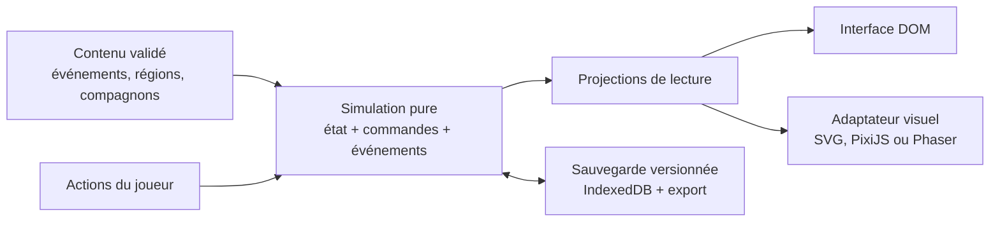

# Options réalistes d’architecture pour le jeu navigateur

_Recherche arrêtée au 18 juillet 2026 — ticket « Établir les options réalistes d’architecture pour le jeu navigateur »._

## Question et périmètre

La V1 visée est un jeu de gestion narratif 2D pour navigateurs de bureau : temps discret, nombreux écrans textuels, coupe interactive du convoi, carte météorologique animée et tableaux d’exploration courts. Le Porte-Lanterne commande à distance ; le jeu n’a ni déplacement direct du personnage ni combat temps réel. La campagne doit être sauvegardée à chaque étape et rester produisible par une petite équipe assistée par l’IA.

La question n’est donc pas « quel moteur peut afficher de la 2D ? », mais quelle part du jeu mérite un moteur de rendu. Trois architectures restent réalistes :

1. application DOM/SVG, sans moteur de jeu généraliste ;
2. application DOM avec PixiJS comme rendu 2D ciblé ;
3. application DOM avec Phaser comme runtime des surfaces de jeu.

La recherche ne choisit pas encore entre elles. Elle établit d’abord le socle qu’elles doivent partager, puis leurs coûts distinctifs.

## Résultat synthétique

- **Le cœur du jeu doit être indépendant du rendu dans les trois options.** Les règles, le calendrier discret, les ressources, les compagnons, les relations, les conséquences et l’aléatoire appartiennent à une simulation TypeScript déterministe, appelable par commandes et testable sans navigateur.
- **L’interface textuelle doit rester dans le DOM.** Conseils, affectations, inventaires, dialogues, journaux, réglages et aides ne gagnent rien à devenir des pixels dans un canvas. Un canvas seul n’expose pas ses objets dessinés aux outils d’accessibilité comme le fait le HTML sémantique ([MDN, élément `canvas`](https://developer.mozilla.org/en-US/docs/Web/HTML/Reference/Elements/canvas#accessibility)).
- **Le choix ouvert porte surtout sur les quatre surfaces visuelles** : coupe du convoi, carte météo, route régionale et tableaux d’exploration. DOM/SVG suffit si elles restent schématiques ; PixiJS apporte un renderer et un graphe de scène ; Phaser ajoute par-dessus des scènes, caméras, entrées, audio, chargement et boucle de jeu.
- **La sauvegarde ne doit dépendre d’aucun de ces renderers.** IndexedDB stocke de manière asynchrone des données structurées et transactionnelles ([MDN, IndexedDB](https://developer.mozilla.org/en-US/docs/Web/API/IndexedDB_API#key_concepts_and_usage)), mais les données d’un site sont par défaut « best effort » et peuvent être évincées ([MDN, quotas et éviction](https://developer.mozilla.org/en-US/docs/Web/API/Storage_API/Storage_quotas_and_eviction_criteria#does_browser-stored_data_persist)). Il faut donc des sauvegardes versionnées et exportables, même si le jeu demande aussi `navigator.storage.persist()`.
- **Aucun backend n’est imposé par la V1 décrite.** Une campagne solo, des graines et un rapport exportable peuvent fonctionner en statique. Synchronisation multiappareil, télémétrie, classements ou partage hébergé seraient les motifs d’introduire un service distant, pas la simulation elle-même.

## Socle commun aux trois options

### 1. Simulation

La simulation est la seule autorité sur l’état de campagne. Une commande telle que `assignWorker`, `chooseRoute`, `resolveEncounter` ou `advanceStage` reçoit un état sérialisable et produit un nouvel état accompagné d’événements de domaine. Le rendu reçoit des projections en lecture ; il ne modifie jamais directement une jauge, une relation ou un inventaire.

Cette frontière est particulièrement importante pour un jeu au temps discret : aucune règle ne doit dépendre d’un `update()` graphique, d’un tween, d’un objet de scène ou de la fréquence d’images. L’état du générateur pseudo-aléatoire, ou au minimum sa graine et sa position reproductible, appartient également à la simulation. Une même sauvegarde et une même commande doivent donner le même résultat, ce qui rend possibles les tests de scénarios et les rapports d’expédition reproductibles.

### 2. Présentation et interaction

L’interface DOM envoie des actions sémantiques (`confirm`, `cancel`, `inspectModule`, `selectChoice`) par un point d’entrée unique. L’adaptateur visuel traduit les clics ou touches sur un objet dessiné vers ces mêmes actions. Les modales DOM suspendent explicitement les entrées de la surface visuelle pour éviter qu’un clic traverse une décision et touche la carte.

Le HTML gère le texte dense et les contrôles. Le SVG inline est une option crédible pour les schémas : ses éléments restent présents dans le DOM et accessibles à l’Accessibility Object Model ; `<title>`, `<desc>` et `aria-labelledby` peuvent les décrire ([MDN, SVG dans HTML](https://developer.mozilla.org/en-US/docs/Web/SVG/Guides/SVG_in_HTML#best_practices)). À l’inverse, un canvas doit avoir un équivalent DOM ou une description pertinente lorsqu’il porte de l’information ([standard HTML, canvas et contenu de repli](https://html.spec.whatwg.org/multipage/canvas.html#best-practices)).

### 3. Contenu

Les quelque soixante événements, régions, modules et personnages doivent vivre dans `content/`, derrière des identifiants stables, et non dans des callbacks d’interface ou de scène. Une étape de build vérifie au minimum :

- schéma et champs obligatoires ;
- unicité et validité des identifiants et références ;
- conditions atteignables et choix non vides ;
- effets connus par la simulation ;
- clés de texte et assets existants ;
- règles éditoriales propres au projet.

JSON Schema fournit précisément un vocabulaire standard de validation des documents JSON ; sa version publiée actuelle est 2020-12 ([spécification JSON Schema](https://json-schema.org/specification)). JSON, YAML ou modules TypeScript restent des choix d’auteur à décider plus tard, mais les types de compilation seuls ne remplacent pas la validation à l’ingestion : le pipeline doit rejeter un contenu invalide avant qu’il n’entre dans le jeu. Cette barrière est d’autant plus utile que l’IA produira des variantes de contenu.

### 4. Sauvegarde

Une sauvegarde contient des valeurs de domaine — identifiants, nombres, chaînes, listes, cartes simples, état de l’aléatoire et version de contenu — jamais des nœuds DOM, textures, sprites, scènes, fonctions ou caches. IndexedDB accepte les objets compatibles avec le clonage structuré dans des transactions asynchrones ([MDN, IndexedDB](https://developer.mozilla.org/en-US/docs/Web/API/IndexedDB_API#key_concepts_and_usage)), mais fonctions et nœuds DOM ne sont pas clonables ([MDN, algorithme de clonage structuré](https://developer.mozilla.org/fr/docs/Web/API/Web_Workers_API/Structured_clone_algorithm#ce_qui_ne_marche_pas_avec_le_clonage_structur%C3%A9)).

Le port `SaveRepository` masque IndexedDB au reste du jeu et prend en charge :

- un autosave atomique à chaque étape, plus quelques points de rotation ;
- `schemaVersion` et migrations testées ;
- export/import d’un fichier portable pour récupération manuelle ;
- détection des erreurs de quota et message au joueur ;
- demande de stockage persistant, sans la considérer comme garantie.

`localStorage` peut conserver de petits réglages, mais pas être la base des campagnes : l’API est synchrone et bloque le thread appelant ([MDN, Web Storage](https://developer.mozilla.org/en-US/docs/Web/API/Web_Storage_API#concepts_and_usage)).

### 5. Assets et outillage

Un manifeste donne aux images, sons, atlas et polices des clés logiques stables ; les noms de fichiers ne deviennent pas l’API du jeu. Le build vérifie les références de contenu et produit des paquets par région ou par écran. Le runtime peut alors précharger le socle, charger une région à la demande et libérer ce qui n’est plus utile.

La pyramide de vérification commune est : tests unitaires de simulation sans renderer, scénarios de campagne reproductibles, validation exhaustive du contenu, tests d’intégration du pont DOM/rendu, puis tests navigateur sur les parcours et sauvegardes. Les captures visuelles et mesures de fluidité concernent seulement les surfaces rendues ; elles ne doivent pas être le seul oracle des règles.

## Option A — Application DOM/SVG, sans moteur de jeu généraliste

### Forme

Une application web à composants — framework à choisir ultérieurement — rend tous les écrans. Les coupes, cartes et tableaux sont des SVG inline composés d’éléments interactifs ; CSS/Web Animations anime les transitions. Un petit canvas 2D purement décoratif peut servir aux particules de cendre, sans posséder d’état métier.

### Pourquoi elle convient

- La majorité de la boucle est constituée de textes, listes, arbitrages et changements d’état discrets.
- La coupe du convoi et un tableau à quelques zones reliées peuvent être exprimés comme des schémas SVG plutôt que comme des mondes à caméra libre.
- Le DOM offre directement mise en page, focus, sélection de texte, lecteur d’écran, zoom du navigateur et inspection par les outils web.
- Il n’y a qu’un modèle d’interface et aucun pont de cycle de vie entre moteur et application.

### Coûts et seuil de rejet

L’équipe doit construire elle-même la caméra éventuelle, le hit-testing complexe, le chargement d’assets, la coordination audio et les effets de particules. De très nombreux éléments SVG animés ou des effets plein écran peuvent aussi rendre cette voie plus coûteuse à optimiser. Elle cesse d’être la meilleure candidate si les tableaux deviennent des scènes à déplacement continu, avec beaucoup de sprites, profondeur, masques, filtres ou caméra.

## Option B — Application DOM + PixiJS 8 comme renderer ciblé

### Forme

L’application DOM reste l’hôte. Une ou plusieurs surfaces y montent un adaptateur PixiJS pour la coupe, la météo et les tableaux. PixiJS se décrit comme un moteur de rendu 2D ; son `Application` installe renderer, canvas et ticker, avec WebGL par défaut et WebGPU en option ([documentation PixiJS, `Application`](https://pixijs.com/8.x/guides/components/application)). Son système `Assets` est asynchrone, met en cache les ressources et accepte manifests et bundles ([documentation PixiJS, `Assets`](https://pixijs.com/8.x/guides/components/assets)).

Au moment de la recherche, la dernière release officielle est **8.18.1**, publiée le 14 avril 2026 ([release PixiJS 8.18.1](https://github.com/pixijs/pixijs/releases/tag/v8.18.1)).

### Pourquoi elle convient

- Elle apporte sprites, graphe de scène, filtres, masques, ticker et chargement sans imposer un modèle complet de jeu.
- Elle convient si les surfaces animées ont besoin d’un renderer accéléré, mais que tours, événements, navigation et UI restent entièrement applicatifs.
- Le nombre de concepts moteur exposés au cœur reste petit : l’adaptateur transforme une projection de lecture en objets PixiJS.

### Coûts et seuil de rejet

PixiJS fournit les briques de rendu, pas l’architecture métier du jeu. L’équipe doit définir scènes/écrans, caméra, actions, audio, pause, nettoyage et pont DOM elle-même. Cette liberté peut devenir du travail de moteur artisanal si les tableaux réclament finalement une orchestration classique de jeu. Elle est à écarter si l’on réimplémente progressivement la plupart des systèmes déjà cohérents dans Phaser.

## Option C — Application DOM + Phaser 4 comme runtime des surfaces de jeu

### Forme

L’application DOM héberge une instance Phaser dans un conteneur réservé. Les tableaux, cartes et coupe sont des scènes ou vues Phaser ; les panneaux de décision restent dans le DOM. L’adaptateur de scène reçoit une projection de simulation et renvoie uniquement des actions.

Dans le code officiel de Phaser 4.2.1, une `Scene` possède sa propre display list, boucle de mise à jour, caméras, gestion d’entrée et loader ; plusieurs scènes peuvent tourner ensemble ([source `Scene.js` 4.2.1](https://github.com/phaserjs/phaser/blob/v4.2.1/src/scene/Scene.js)). La configuration expose notamment renderer, parent DOM, canvas, scènes, graine, entrées, loader, échelle et audio ([source `GameConfig.js` 4.2.1](https://github.com/phaserjs/phaser/blob/v4.2.1/src/core/typedefs/GameConfig.js)). `AUTO` choisit WebGL puis retombe sur Canvas, tandis que le mode headless reste dépendant du DOM et est destiné aux tests unitaires du runtime, pas à l’exécution serveur ([source `const.js` 4.2.1](https://github.com/phaserjs/phaser/blob/v4.2.1/src/const.js)). Cette dernière contrainte renforce l’intérêt de tester la simulation pure hors de Phaser.

La version courante au moment de la recherche est **4.2.1**, publiée le 9 juillet 2026 ([release Phaser 4.2.1](https://github.com/phaserjs/phaser/releases/tag/v4.2.1)). Phaser 4.0.0 datant du 10 avril 2026, la branche majeure est récente ; le risque de changements et de régressions d’intégration doit être évalué explicitement, même si les concepts historiques de scène demeurent.

### Pourquoi elle convient

- Elle fournit immédiatement scènes, caméras 2D, entrée, audio, chargement, échelle, animation et cycle de vie.
- Elle laisse de la marge si les tableaux gagnent en mouvement, effets et interactions spatiales au fil de la production.
- Sa structure convient à des surfaces distinctes comme route, convoi et exploration, à condition qu’une scène orchestre la vue sans posséder les règles.

### Coûts et seuil de rejet

Le runtime est plus large que le besoin immédiat d’un jeu lent, sans physique ni contrôle direct. Il crée aussi deux cycles de vie — application DOM et Phaser — et la tentation de placer état, texte ou règles dans le registre et les scènes du moteur. Cette option perd son avantage si la majorité des scènes se résume à quelques zones cliquables et si les caméras, animations et entrées du moteur restent presque inutilisées.

## Comparaison

| Critère | DOM/SVG | DOM + PixiJS 8 | DOM + Phaser 4 |
|---|---|---|---|
| UI narrative et accessibilité | Native ; un seul arbre DOM | Native côté DOM ; équivalent à prévoir pour le canvas | Native côté DOM ; équivalent à prévoir pour le canvas |
| Surfaces animées | Suffisant pour schémas et animation modérée | Très bon renderer 2D ciblé | Très bon runtime 2D complet |
| Caméras, scènes, entrées, audio | À construire au besoin | À assembler | Déjà intégrés |
| Frontière simulation/rendu | Simple à maintenir | Adaptateur explicite requis | Discipline forte requise face aux commodités du moteur |
| Pipeline d’assets visuels | À construire | Assets, cache, manifest/bundles | Loader et caches intégrés |
| Tests de règles hors navigateur | Excellents si le cœur est pur | Identiques | Identiques ; ne pas dépendre du headless Phaser |
| Risque principal | Refaire tardivement un renderer | Refaire progressivement un moteur | Surdimensionnement et couplage aux scènes |
| Condition favorable | Visuels schématiques | Visuels riches, orchestration légère | Visuels riches et besoins récurrents de runtime de jeu |

## Comment départager sans préjuger

La prochaine décision devrait reposer sur un prototype technique jetable d’un même écran représentatif, pas sur un écran de menu. Le meilleur candidat est un tableau d’exploration comprenant : quatre zones reliées, météo animée, deux personnages, survol/sélection, zoom léger, une décision DOM modale, navigation clavier, redimensionnement et restauration depuis une sauvegarde.

Le prototype doit mesurer :

- temps et quantité de code pour produire puis modifier le tableau ;
- netteté du pont entre simulation, DOM et renderer ;
- comportement du focus, du clavier et de la modale ;
- fluidité sur un ordinateur portable cible avec les effets visuels prévus ;
- poids de chargement et complexité du pipeline d’assets ;
- facilité des tests automatiques et du diagnostic par une petite équipe assistée par l’IA.

Les règles de décision deviennent alors simples :

- retenir DOM/SVG si le prototype atteint la direction visuelle sans construire de sous-système de jeu ;
- retenir PixiJS si le canvas apporte un gain visuel net mais que l’orchestration demeure légère ;
- retenir Phaser si ses scènes, caméras, entrées, audio et loader sont réellement utilisés sur plusieurs surfaces et réduisent le code propre au projet.

Cette recherche réduit donc le choix à trois architectures compatibles avec le jeu, toutes adossées au même noyau de simulation et de sauvegarde. Elle ne désigne volontairement pas encore la gagnante.

## Note de méthode

Context7 a d’abord résolu Phaser vers la source officielle `/phaserjs/phaser` et a fourni la documentation indexée de Phaser 3.90. Comme l’amont était déjà passé à Phaser 4, les faits de version et d’API utilisés ici ont ensuite été revérifiés sur la release et le code source officiels 4.2.1. Les autres faits viennent des documentations officielles PixiJS, des standards du Web et de MDN, de la spécification JSON Schema et des releases GitHub des projets.
